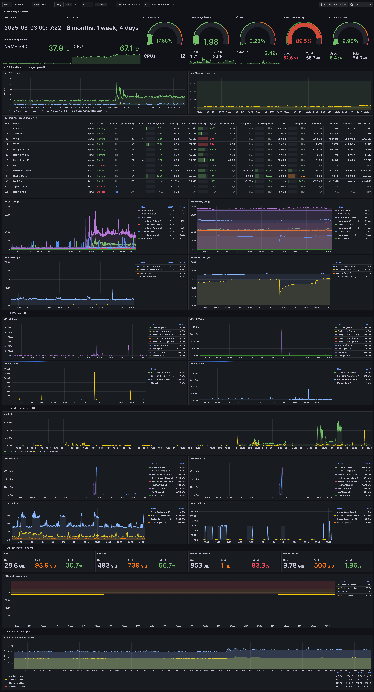

# proxmox-via-prometheus-influxdb-dashboard
Grafana Dashboard for Proxmox using Prometheus and InfluxDB

Repository for [this](https://grafana.com/grafana/dashboards/10347-proxmox-via-prometheus/) Grafana dashboard.
The dashboard displays data scraped from [prometheus-pve-exporter](https://github.com/prometheus-pve/prometheus-pve-exporter) and metrics stored in InfluxDB from PVE metric server.

Repo to keep track of the changes to the dashboard and collect issues (better than reviews).

## Data Sources

This dashboard integrates data from multiple sources:

- **Prometheus**: Metrics scraped using [prometheus-pve-exporter](https://github.com/prometheus-pve/prometheus-pve-exporter) for real-time Proxmox monitoring
- **InfluxDB**: Historical metrics stored in InfluxDB from PVE (Proxmox Virtual Environment) metric server for long-term data retention and analysis

## Screenshots

